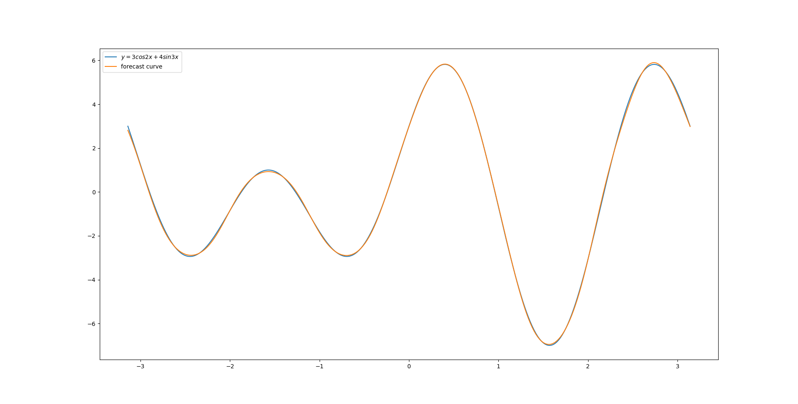
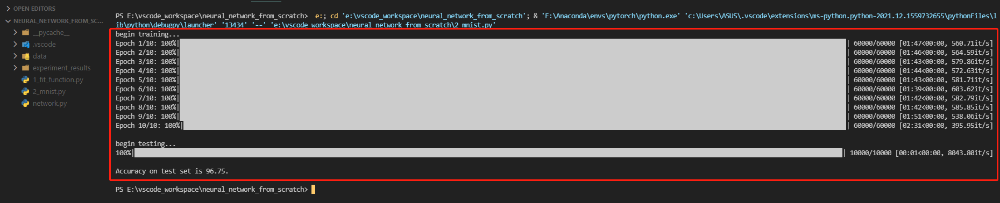

# artificial-neural-network-from-scratch  
    Here is a simple implementation of artificial neural network(ANN). The ANN has been tested on two tasks: one is a regression task(to fit a given function curves), and the other is a classification task(the dataset is MNIST). The results are shown as follows:  
      
      
